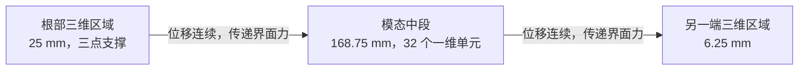

# 三维实体端部与截面模态中段

本试验保留三点六个标量位移约束。根部其余节点可以自由变形。两端使用现有
C3D20T 二十节点实体单元，中段使用二维截面模态与一维五次 Hermite 单元。
端部实体位移在求解后恢复，最终全局方程只保留中段的一维幅值。



## 输入与文件边界

`[SectionModes]` 中的 `count` 指中段模态数量，至少为 10。
`[solid_ends]` 子段通过 `lower_interface`、`upper_interface` 指定完整的 Exodus
截面节点集。可以只指定其中一个端部；两个连接面必须留下非空中段。
端部长度和所有网格节点均来自 Exodus，输入卡中没有隐式网格生成参数。
本轮不组合宽度分条或原有端部高阶模态扩充。
输入仍使用一个完整挤出的 Exodus 文件提供截面、轴向节点和载荷边集。
中段网格提供一维离散信息，实际三维单元装配只发生在指定端部。当前连接面
必须匹配，并且截面几何和材料区域沿轴向保持不变。

- `src/solver/section_modal_solver.cpp` 建立混合未知量、真实物理边界、稀疏装配，
  并复用已有局部方程静力凝聚和线性求解。
- `src/solver/modal_solid_end.*` 将实体节点位移映射到独立端部位移与界面模态，
  调用 `elements::evaluate_c3d20t`，返回转换后的内力、刚度和原始材料点场。
- `src/io/case_input.cpp` 解析完整输入卡；`src/app/section_modal_case.cpp` 输出实际
  一维幅值数量、实体位移数量、局部及全局方程数量和全部材料点。
- `verification/section_modal/compare.py` 读取生产输出，分别按实体三点与一维六点
  轴向积分规则恢复场，再与完整三维模型的全部节点及积分点比较。

## 离散与界面传递

令一维界面幅值及其离散导数为 `a`，实体端部独立位移为 `v`。界面节点满足

```
u_Gamma = Phi0 a + Phi1 a_z + Phi2 a_zz,
u_s = T [a, v].
```

`T` 中实体内部自由度对应单位行，界面行来自现有截面形函数与模态系数。
混合经典模态已将能够独立表示的导数场展开成独立幅值。实现仍保留一般导数
形式的映射，不删除尚未被独立位移空间表示的导数贡献。

从实体单元虚功直接得到

```
delta W_s = delta u_s^T r_s = delta [a,v]^T T^T r_s,
r_av = T^T r_s,
K_av = T^T K_s T.
```

因此界面位移连续，力传递与位移映射互为转置，不需要罚参数或人为弹簧。
实体单元采用原有 27 个材料积分点和真实材料接口；中段截面积分仍逐点调用
材料响应。截面材料状态没有被模态幅值替代。

施加实际位移约束后，将实体位移和仅作用在实体上的约束乘子合并为局部量 `l`。
令中段幅值为 `g`，消元方程为

```
K_LL Y = K_LG,       K_LL b = f_L,
(K_GG - K_GL Y) g = f_G - K_GL b,
l = b - Y g.
```

复用 PETSc/MUMPS 因子分解，仅对实际连接面列求解多个右端项，不显式求逆。
真实材料点残量用于线性修正，避免细长结构中刚度乘位移的大数相减影响平衡。
每个实体或一维单元的装配只有一个 MPI 进程负责。

线性修正保留满足原有功一致性条件且实际材料点残量最小的解。接近舍入误差时，
最后一次修正不一定最好。摘要分别输出选中的修正次数、末次残量与所选解残量，
没有放宽求解或验收条件。

## 试验与风险

第一组使用长 200 毫米、宽 20 毫米、厚 2 毫米的均匀铝板。横截面为 4×8 个
八节点四边形。根部 A=(0,0,0) 约束三个分量，B=(1毫米,0,0) 约束 y、z，
C=(0,10毫米,0) 约束 z。中段保留 12 个模态。
初始非均匀载荷试验在两端各取 6.25 毫米，每端 32 层实体单元，完整应力误差
为 1.1461%，没有通过 1% 门槛。这个结果保存在 `short_nonuniform_comparison.csv`，
对应 `nonuniform_solid_ends_12.fsi`。

最终四个 `*_hybrid_12.fsi` 使用根部 25 毫米、另一端 6.25 毫米的三维区域，
分别为 128 层、32 层，层厚与 1024 层完整三维参考一致。中间 168.75 毫米使用
32 个一维单元。轴向拉伸、端面弯矩、均布横向载荷和半宽非均匀载荷均使用独立、
完整、可直接运行的生产输入卡。

三点支撑的局部应力受三维网格影响。本试验首先比较相同端部网格下的离散解，
不能据此宣称点支撑奇异应力已经达到连续体网格收敛。连接面上只允许低阶截面
空间，仍可能在连接面附近引入误差。端部区域扩长会降低这种误差，但会增加局部
因子分解成本。因此同时报告全域误差、局部及全局未知量、包含预处理与场输出的
外部运行时间和峰值内存。

验收沿用全部参考节点的位移向量相对 L2、全部材料点的体积加权轴向应力及
完整应力张量相对 L2、全部参考截面的弯矩相对 L2、总应变能相对误差均小于
1%。轴向拉伸的零弯矩使用原有绝对误差门槛。不得剔除根部、平移旋转对齐场，
或通过放宽门槛将未通过结果记作通过。

## 当前数学验证

下表数值均为百分比。L2 指对误差平方积分或求和后开平方，再除以同样计算的
参考量范数；这里没有使用最大逐点误差作为 1% 验收指标。

| 载荷 | 位移向量 L2 | 轴向应力 L2 | 完整应力张量 L2 | 弯矩 L2 | 总应变能 |
| --- | ---: | ---: | ---: | ---: | ---: |
| 轴向拉伸 | 0.00009478 | 0.037172 | 0.102400 | 使用绝对量 | 0.00012123 |
| 端面弯矩 | 0.00013608 | 0.017708 | 0.049842 | 0.00019083 | 0.00014243 |
| 均布横向载荷 | 0.00064597 | 0.040058 | 0.206484 | 0.00079356 | 0.00074430 |
| 半宽非均匀载荷 | 0.00064678 | 0.049360 | 0.217299 | 0.00079366 | 0.00077369 |

四种载荷的全部指标通过原有门槛。轴向零弯矩差为 `4.2745e-13 N m`，小于
`1e-10 N m`。原轴向三维参考只做了一次 Newton 更新，零弯矩受求解误差污染。
将该参考输入的绝对残量容差从 `1e-8` 收紧至 `1e-10` 后重新求解，保持网格、
材料、载荷及六个位移约束不变。验收门槛没有调整。其他三种载荷的比较参考仍
使用原有求解容差。这里验证的是完整 Fuelsim 三维模型，不是新的 Abaqus 对标。

连接面内部测试覆盖六种刚体运动、拉伸刚度 EA、弯曲刚度 EI、正确轴向应变和
剪切消除、实际残量的中心差分方向导数以及能量与虚功。方向导数相对误差为
`2.01501e-14`。单进程与双进程输出的位移 L2 差为 `1.17e-15`，中段应力为
`1.08e-12`，端部应力为 `2.36e-11`；分别检查两种积分规则的全部材料点。

## 计算规模

| 数量 | 混合模型 | 完整三维参考 |
| --- | ---: | ---: |
| 三维实体单元 | 5,120 | 32,768 |
| 一维轴向单元 | 32 | 0 |
| 保留的一维轴向节点 | 33 | 不适用 |
| 最终全局力学未知量 | 1,188 | 510,315 |
| 局部三维位移未知量 | 79,680 | 不适用 |
| 局部方程数，含六个约束乘子 | 79,686 | 不适用 |
| 完整生产方程数，含固定温度 | 不求解温度 | 556,440 |
| 材料积分点 | 193,536 | 884,736 |

1,188 为 `33 * 12 * 3`，每个幅值在节点保存值和两个导数。端部消元仍要分解
79,686 阶局部矩阵，不能将 1,188 与完整三维未知量的比值当作全部工作量或加速比。

同一个 Release 可执行文件，在 CPU 0、单线程 MUMPS 下交替运行两轮均布横向
载荷，外部计时包括网格读取、截面预处理、局部消元、求解、材料点恢复和全部
文件输出。比较脚本在计时区间外运行，每轮都重新检查原有完整三维精度门槛。

| 模型 | 第一轮，秒 | 第二轮，秒 | 平均时间，秒 | 两轮最大峰值内存，GiB |
| --- | ---: | ---: | ---: | ---: |
| 三维端部与模态中段 | 9.77 | 9.51 | 9.64 | 1.49 |
| 完整三维模型 | 78.96 | 78.35 | 78.66 | 9.42 |

本例完整运行的平均速度提高约 8.16 倍，峰值内存降低约 84.1%。这不是只计算
1,188 阶最终方程的时间，也不是将不同硬件或不同求解器的运行时间作比值。
初始 6.25 毫米端部的应力未通过结果没有进入这个性能结论。

本功能初次验收时，Release 构建将警告视为错误；统一入口 `ctest --test-dir build -j8 --output-on-failure`
通过全部 331 项测试，耗时 643.46 秒，包含本次实体端部端到端比较与双进程检查。
测试套件重算完整三维参考的总时间与上述单个混合模型的运行时间分开记录。

随后按用户要求，将五项完整三维比较移至手动执行，自动套件保留 326 项。
实体端部和局部模态的双进程检查保留，每次独立计算串行降阶结果，不再依赖
完整三维参考。五项手动命令见[截面模态验证说明](../verification/section_modal/README.md#复现)。

## 复现

环境需要 NumPy 和 netCDF4；本机验证解释器为 `/home/cooper/miniforge/bin/python3`。
所有 `.fsi` 文件直接提交，脚本只逐字复制完整输入卡。

```bash
cmake --build build --parallel 4
ctest --test-dir build -j8 --output-on-failure

# 先生成四个完整三维参考；此入口不生成或修改输入卡。
python verification/section_modal/width_study.py \
  build/fuelsim build/blackbox/solid_end_reference build/blackbox/solid_end_reference \
  --reference-only --cpu 0
python verification/section_modal/solid_end_study.py \
  build/fuelsim build/blackbox/solid_end_comparison build/blackbox/solid_end_reference

# 同一可执行文件、CPU 0、单线程、MUMPS，交替顺序运行两轮，包含全部输出。
python verification/section_modal/benchmark.py \
  build/fuelsim build/blackbox/solid_end_benchmark --solid-ends --cpu 0 --repeats 2
```

数值结果与输入、网格、参考文件及可执行文件的校验值位于
[`verification/section_modal/results/solid_ends`](../verification/section_modal/results/solid_ends)。
