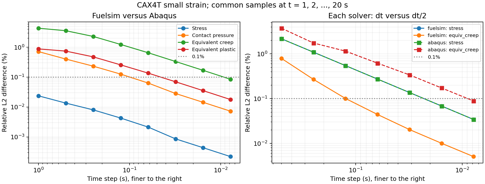

# 小应变 CAX4T 综合例题的时间步细化研究

2026-09-07 完成八级比较。Fuelsim 始终使用后向欧拉隐式蠕变，没有修改材料积分
代码，也没有增加显式分支。结果支持继续保留隐式积分：在较细时间步区间，双方
差异大致随时间步减半而减半。最细一级的十二类场完整历程相对二范数误差均低于
0.1%，但完整历程的逐点指标仍有失败，不能据此宣布原始综合例题通过。

更新：用户已接受最细一级在 9.0390625 秒、节点 28 的低压力局部相对偏差
0.996916%（压力约 2023.77 Pa，绝对差约 20.18 Pa）。不再为这一点继续细化
时间步；其他场量、压力整体误差和压力峰值仍保持原验收要求。该接受不等于
完整历程全部指标通过，具体范围见 [更新后的验证结论](B16_CONTACT_DIAGNOSIS.md)。

## 固定条件与比较方法

使用 B13 small/CAX4T 原有 34 个单元、53 个节点、20 秒载荷，双方保持小应变、
相同材料、节点到面热机械接触和 Abaqus 默认接触平滑。导热系数表保持已验证的
0.2 K 间距。只逐级改变双方固定时间步；Abaqus 的最细一级另调整热方程数值
收敛条件，原因与独立敏感性检查见下文。Fuelsim 七级新增计算均完成规定步数，
没有缩小失败时间步重试。原始 1 秒级使用已有正式结果。

完整历程比较使用每一级的全部时间步；另在共同的 `t=1,2,...,20 s` 比较双方及
各程序相邻两级结果，避免采样频率变化影响收敛判断。温度、等效应变及接触量
使用标量误差，位移使用二维向量，应力及各应变使用完整轴对称张量，其中剪切
分量按张量内积乘 `sqrt(2)`。不设置相对误差分母下限；零参考值单独报告绝对
误差。只有已独立验证的规定零位移被规范为零。

## 全部时间步的双方误差

以下为相对二范数误差，单位均为百分比。

| 时间步，秒 | 步数 | 应力 | 接触压力 | 等效塑性 | 等效蠕变 |
| ---: | ---: | ---: | ---: | ---: | ---: |
| 1 | 20 | 0.0238057 | 0.717287 | 0.881255 | 4.33541 |
| 0.5 | 40 | 0.0155903 | 0.514834 | 0.757818 | 3.68100 |
| 0.25 | 80 | 0.00845400 | 0.271407 | 0.493271 | 2.39341 |
| 0.125 | 160 | 0.00419825 | 0.134824 | 0.268614 | 1.29944 |
| 0.0625 | 320 | 0.00214041 | 0.0689878 | 0.142809 | 0.689185 |
| 0.03125 | 640 | 0.00105949 | 0.0339368 | 0.0729488 | 0.351429 |
| 0.015625 | 1280 | 0.000532685 | 0.0170833 | 0.0370443 | 0.178311 |
| 0.0078125 | 2560 | 0.000265946 | 0.00853467 | 0.0186328 | 0.0896504 |

最细一级十二类场中的最大整体误差是蠕变张量的 0.0902088%。完整数值见
[所有时间步指标](b15_time/all_time_comparison.csv) 与各目录的 `comparison.txt`。

## 各程序自身的收敛

以下是在共同的二十个时刻，以 `dt=0.0078125 s` 为参考，比较其与
`dt=0.015625 s` 的相对二范数差，单位为百分比。

| 场 | Fuelsim 相邻两级差 | Abaqus 相邻两级差 |
| --- | ---: | ---: |
| 应力 | 0.0342376 | 0.0342223 |
| 接触压力 | 0.0864265 | 0.0815995 |
| 等效塑性 | 0.0722483 | 0.0547294 |
| 等效蠕变 | 0.00506552 | 0.0886933 |

在较细区间，应力及蠕变相关差异呈接近一阶的下降趋势，没有观察到明显的非零
误差平台。这是时间积分差异占主导的证据，不是连续时间精确解的证明，也不能
把双方接近程度直接当成各自的时间离散误差。



左图是双方差异，右图是各程序相邻时间步的差异；横轴向右表示时间步减小。
详细数据见 [共同采样比较](b15_time/common_time_comparison.csv) 和
[各程序收敛数据](b15_time/self_convergence.csv)。

## 完整历程与终态的区别

最细一级在 20 秒终态，十二类场的整体、峰值及最大逐点相对误差均低于 0.1%，
最大逐点值为蠕变张量的 0.0533512%。然而全部时间步的最大逐点误差仍包括：

- 应力 0.165091%；接触压力 0.996916% 对应上述用户已接受的低压力样本。
  两者的原始相对误差均保留，应力指标没有因此获得豁免。
- 等效塑性 100%，对应双方材料激活过程的差异。
- 等效蠕变约 7.50365e8%，对应 Fuelsim 的 8.62976e-20 和 Abaqus 的
  1.15007e-26；这一极大百分比不能代表有显著蠕变的整体场误差。
- 间隙约 100.578%，对应 -2.82257e-14 m 与 4.88508e-12 m，处于闭合附近。

这些数值均保留在原始误差报告中，没有删除字段或放宽 0.1% 的验收门槛。
终态数据另见 [20 秒比较](b15_time/end_time_comparison.csv)。

## 最细一级的 Abaqus 数值收敛条件

Abaqus R2018x 在 `dt=0.0078125 s` 的第一步无法满足原始热收敛条件：热残量
在约 1.9e-12 至 4.1e-12 W 波动，温度修正约 5e-14 至 8e-14 K。原始相对
条件 `1e-10` 对应约 1.9e-14 W 的热残量要求和约 9.3e-15 K 的修正要求，
小于此时的数值波动。仅改变热残量条件仍失败于温度修正条件。

因此最细一级的 `*Controls, parameters=FIELD, field=TEMPERATURE` 前两项
改为 `1e-7, 1e-7`；机械条件、时间步、材料积分、其他参数均不变。额外在
0.015625 秒复算相同调整：共同采样时刻十二类场的最大整体差小于 5.8e-10%，
最大逐点差小于 7.1e-8%，远小于本研究观察到的差异。这里调整的是求解器数值
收敛条件，未调整结果精度判据。该检查仅在 0.015625 秒完成，没有声称能与
无法完成的最细级原始条件结果比较。

完整输入位于 `b15_time/dt0015625_heat_tol`，敏感性结果见
[热收敛条件敏感性](b15_time/heat_tolerance_sensitivity.csv)。

## 文件、验证与复现

七张完整 Fuelsim 输入为 `verification/fuelsim/transient_b15_time_<编号>.fsi`；
Abaqus 完整输入保存在 `b15_time/dt<编号>/b13_small_cax4t.inp`。编号依次为
`050, 025, 0125, 00625, 003125, 0015625, 00078125`。本研究是手动细化资料，
没有将重复扫描注册为自动测试。

Abaqus 使用 `run_b13_pcmi.ps1`，`Cases=b13_small_cax4t`，`InputDirectory`
指定相应子目录，`DestinationDirectory` 指定隔离结果目录。该运行器复制既有
网格 include，不修改物理输入。压缩 CSV 保存完整原生历史，`run.txt` 记录原生
输入与提取器散列值。八个原生运行的输入散列均与保存的输入一致。

Fuelsim 使用生产入口运行完整卡片；生产输出经计算后移入 `build/b15_time`
对应目录。`production_runs.csv` 保存输入、可执行程序和输出文件的散列值。
结果检查器仅增加可选的预期时间步数参数，保留原始例题的默认步数和精度规则。
它读取全部生产输出，不链接求解器或重新求解。原始三个 CAX4T 比较复测结果
仍是有限应变通过、小应变和含摩擦例题精度失败。

共同采样脚本在原始一级复现了 C++ 检查器的全部十二类场整体误差。分析读取
保存的原生 CSV 与生产 Exodus，不生成或修改输入：

```bash
MPLCONFIGDIR=/tmp/b15-matplotlib \
NETCDF_LIBRARY=/home/cooper/miniforge/envs/moose/lib/libnetcdf.so \
python verification/abaqus/analyze_b15_time.py
```

研究子目录的完整性使用独立散列清单检查，不改变现有自动测试的清单格式：

```bash
cd verification/abaqus/b15_time
sha256sum --check SHA256SUMS --quiet
```

## 建议

保持 Fuelsim 的隐式蠕变积分。若关注本例的整体历程或终态，0.0078125 秒提供了
目前已验证的低于 0.1% 的整体比较；代价是步数由 20 增至 2560，不能仅据此
更改默认时间步。若仍要求完整历程所有逐点指标低于 0.1%，当前研究尚未达到，
其他未通过指标需要独立研究；不再为已接受的局部压力偏差继续细化时间步，
也不能以终态通过替代完整历程的其他要求。

后续针对约 0.99% 接触压力相对误差峰值完成了
[独立接触误差隔离研究](B16_CONTACT_DIAGNOSIS.md)：确认另有导热表插值影响，
但它不足以解释原峰值；平滑、罚压力定律和节点面积也分别作了直接核对。
